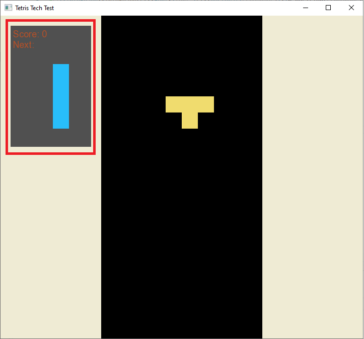

# Storm Flag Associate/Co-op Engineering Tech Test

## Overview 
This repository contains a basic implementation of the classic game "Tetris". Your assignment is to improve the game by adding the features listed below. 

## Procedure
To perform this tech test, you will need to modify the code in this repository. To get started:

1. Initialize this directory as a git repo, by typing `git init .` 
2. Install [Node.js](https://nodejs.org). This should also install the node package manager, npm. On linux/Mac machines, you may already have this. 
3. Install [TypeScript](https://www.typescriptlang.org/). This is done via npm. Once done you should be able to type `tsc -v` and have typescript report a version number. 
4. Install [VSCode](https://code.visualstudio.com/). This is not required, but if you don't already have a favorite IDE for editing Typescript, vscode is a good one, and it is cross platform. 
5. Build the project (go to the project directory in a terminal window and type `tsc -p tsproj`). 
6. Run a webserver in the project/client_www directory (see FAQ if you are unsure how to do this). 
7. Browse to the localhost site you are hosting. You should see the base implementation of tetris running.
8. You can now start modifying the project in vscode (You should be able to load the project via `code tsproj` in the top-level project directory). 
9. Because you're in a git repository you should use git to organize your work. Start by making a working branch and switch to it, for example: `git checkout -b <yourname>`. When you submit your solution directory, zip the entire directory, including the repository files. 

## Features To Implement 

### Make Pieces Appear in Tetris Order
This implementation currently generates pieces in purely random order, but this is not quite correct. Tetris generates pieces in a very specific way, according to the so-called "Tetris Random Algorithm". The algorithm works like this:

  * On start, the game generates a list of all 7 tetriminos, and randomizes their order. 
  * Every time the game needs a new piece, it removes an element from this list.
  * When the list is empty, the game generates a new list of all 7 tetriminos, and repeats. 

This is why you will never get three of the same piece in a row in a normal Tetris implementation!

### Implement Scoring, and progressive speed levels. 
True Tetris should speed up as you play! Every 'x' seconds, increase the block drop speed by 'y' tiles/second. Pick values that feel good to you! 

In addition, track the player's score. Traditional tetris scoring is as follows. At speed level 'n' (starting from 0).
* 1 line: 40*(n+1)
* 2 line: 100*(n+1)
* 3 line: 300*(n+1)
* 4 line: 1200*(n+1)

See following task for how to present this score to the player. 

### Implement an Info Box
The Info Box should contain a graphic showing the Next Piece, as well as the current Score. See the following example, with the InfoBox outlined in red. Note that this is a rough example--you are encouraged to improve the appearance of the UI as much as you can!

## Submitting Your Test
Please archive the whole "techtest" directory into a zip file and upload it to the SOLUTION folder that was shared with you via email. You will need to provide a gmail account to upload directly to google drive. If you don't have a gmail account you may email the zip of your test directly to the person who assigned you the test. 

## What You Can And Can't Use

**Things to Use**: You may consult any online documentation you wish. You may even look at other implementations of tetris floating around on the web, but under no circumstances should you actually copy-paste code. Of course you should use all the facilities included in the demo framework. 

**Things Not to Use**: You should not use other people as a resource for this test, even for advice. You should not import any javascript modules into the project (all the code you add should be your own). 

## FAQ

**Can I change any of the core logic in the SFTT namespace?** : Absolutely. Change anything you like (certainly including the index file in client_www). We will be using git to diff your submission with the base submission to see what you changed. 

**I've never done TypeScript before, am I doomed?** : You should be OK as long as you have experience with any OO styled language, like C# or Java. Most of the confusing things about TypeScript are really inherited from Javascript. Be sure to read up on things like "this" in Javascript, "==" vs "===", and "null" vs "undefined". 

**What platforms can I develop on?** : Windows Mac and Linux are all supported by our core development stack (VSCode, node/npm, and TypeScript). 

**How do I add a file to the project?** : Edit the "files" array in tsconfig.json. Note that child classes must be added after base classes, and implementing classes after interfaces. 

**How do I build the project?** : `tsc -p tsproj`, where the argument to '-p' is the tsproj directory in the top-level project directory. This will produce a "sf_techtest.js" file in client_www. 

**How do I host my own webserver?** : We use the npm package `http-server`. You can install this via `npm install -g http-server` and then run it via `http-server -p <port>`. 

**How do I debug?** : Chrome has an excellent set of developer debug tools. Press F12 to bring them up. It's usually quite straightforward to find the bug in javascript and then make the necessary change in TypeScript. 

**How long should this take?** : We think you should be able to complete this test in about 2-3 hours, although some of the more time-consuming tasks might take longer. 
